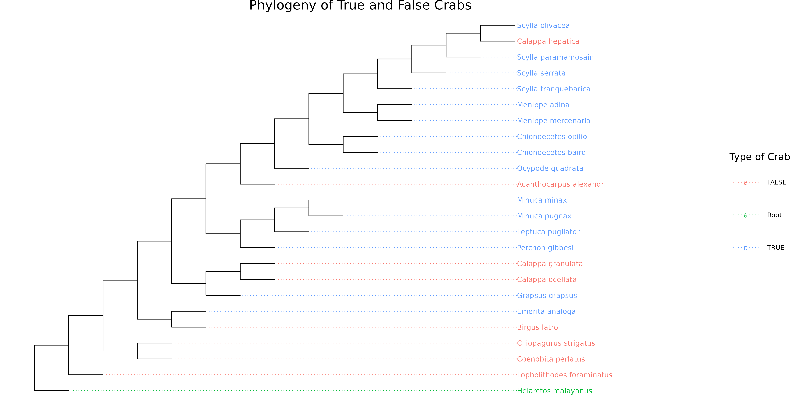
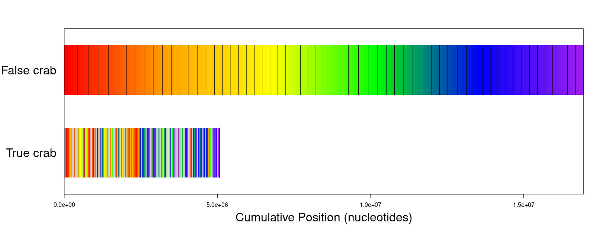

# Evaluation of crabs

## True vs False crabs
The two main groups of crabs that I will be focusing on are true crabs and false crabs. True crabs are the Brachyura infraorder of decapods and have a few main features. First of all, they have 5 pairs of legs, 4 of which are used for walking. In contrast false crabs generally have 2 or 3 pairs of walking legs. True crabs also have short abdomens that curl underneath their body, while false crabs have a longer, less protected abdominal segment or use borrowed shells to protect them.


```{r, message=FALSE, eval=FALSE}
# Packages used in my code
library(tidyverse)
library(ape)
library(phangorn)
library(janitor)
library(rentrez)
library(Biostrings)
library(seqinr)
library(ShortRead)
library(DECIPHER)
library(ggtree)
```

___

## Data

The data I used was fairly simple. I copied the accession numbers of COI genes of many crabs, both true and false crabs, into a vector and made another vector labeling them as true or false crabs. I then used those pull the sequences from genbank and build my own multifasta file and saved it into a dataframe.

```{r eval=FALSE}
#list of accessions
accession_list <- c("KF986481","AY580003", "MG320838", "MN184018","MW124877", "JQ306054", "LC053597", 
                    "HQ241545","JQ306102", "MN184090", "MK916102", "MG320510", "MG321135", "AB857346",
                    "AB114222", "EU664339","AB857347", "MK308325", "KP255317", "MN184051", "KU906044",
                    "MH087706", "HM638048","EF683576")
#True crabs vs false crabs matched with accession list
true_false <- c("Root", FALSE, FALSE, FALSE, FALSE, FALSE, FALSE, FALSE, TRUE, TRUE, TRUE, TRUE, TRUE, TRUE, TRUE, TRUE
                , TRUE, TRUE, TRUE, TRUE, TRUE, TRUE, TRUE, FALSE)
#get sequences and write file if it doesn't already exist
if(file.exists("crabs.fasta")== FALSE){
  for (i in accession_list){
seq <- entrez_fetch(db = "nucleotide",id = i, rettype = "fasta")
seq <- seq %>% str_replace("\n","~") %>% str_remove_all("\n") %>% str_split("~") %>% unlist()
write_lines(seq, "crabs.fasta", append = TRUE)
}
}
#read back in file
fasta <- readFasta("crabs.fasta")
#make dataframe with names, sequences, and if they are a true crab or not
id <- fasta@id %>% as.character %>% unlist
df <- data.frame(accession = id %>% str_split(" ") %>% map_chr(1),
                 species = paste(id %>% str_split(" ") %>% map_chr(2),id %>% str_split(" ") %>% map_chr(3), sep = " "),
                 true_crab = true_false,
                 sequence = fasta@sread)
```
```{r, echo = FALSE, message=FALSE}
library(tidyverse)
library(kableExtra)
df <- readRDS("Crab_data_RDS")
df %>% 
  kbl() %>%  
  kableExtra::kable_styling() %>% 
 scroll_box( height = "300px")
```


___

## Phylogeny

Using the data, I made a phylogenetic tree and rooted it on an ape.
```{r, eval=FALSE}
#align the sequences and add the names
align <- AlignSeqs(fasta@sread)

names(align) <- df$species
#make and root tree
dist_mat <- dist.dna(as.DNAbin(align))
tree <- nj(dist_mat)
rooted <- ape::root(tree, outgroup = 1, resolve.root = TRUE)

#normalize edge length
rooted$edge.length <- rep(.1, Nedge(rooted)) 


#plot tree
p <- ggtree(rooted,layout = "rectangular") + 
  theme(plot.margin = margin(0,0,0,0))+
  coord_cartesian(xlim = c(0,1.9))
p2 <- p + 
  geom_tiplab(align = TRUE, aes(color = df$true), data= p$data %>%dplyr::filter(isTip ==TRUE))+
  guides(color = guide_legend(title = "Type of Crab"))+
  labs(title = "Phylogeny of True and False Crabs")+
  theme(plot.title = element_text(hjust =  .5, size = 20),legend.key.size = unit(.7, "in"),
        legend.title = element_text(hjust = .5, size = 15),
        legend.text = element_text(size = 10))
#show tree
p2
#save tree
ggsave("crab_phylogeny.png",scale = 2)


```


```{r, echo=FALSE}

```

From this we see an interesting property where some of the false crabs appear between the true crabs. This means that either the traits for the true crabs evolved multiple times or the the traits that had already evolved were lost causing what would have been true crabs to become false crabs.


___

## Synteny

I was also curious how the genes mapped between a true crab and a false crab. I downloaded the full genomes from gen bank for Birgus latro, a false crab, and Chionoecetes Opilio, a true crab, and ran a synteny mapping of them.
```{r,eval = FALSE}
#files stored outside of git repository because of size
seqs <- c(Birgus_latro = "../../../crab_full_genome/birgus_latro/ncbi_dataset/data/GCA_018397915.1/filtered.fna",
Chionecetes_opilio = "../../../crab_full_genome/chionoecetes_opilio/ncbi_dataset/data/GCA_016584305.1/filtered.fna"
)

db <- "../../../crab_full_genome/new_db.fasta"
#create database for synteny 
for (i in seq_along(seqs)) {
  Seqs2DB(seqs[i], "FASTA", db, names(seqs[i]))
}
#run synteny analysis 
syn <- FindSynteny(db,minScore=25)
#plot synteny
#bottom left top right
par(mar = c(6,9,4,4))
plot(syn, horizontal=TRUE,width=.6, 
     colorRamp = colorRampPalette(c("red", "orange",
                                    "yellow", "green",
                                    "blue", "purple")),
   barSides = FALSE,
   labels = c("False crab", "True crab"),
   cex.labels = 2)
```

```{r, echo=FALSE}

```

We can see from this that despite this true crabs genome being smaller than the false crab, it has a semi similar pattern of genes as you can still see a distinct change from warm color matches to cool color matches in the genome.


